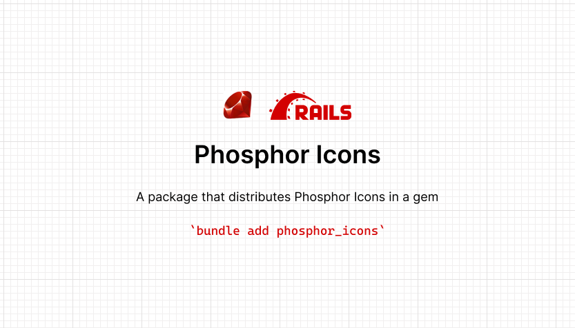

<p align="center">
  
</p>

# Ruby Phosphor Icons

A gem to easily make use of [Phosphor Icons](https://phosphoricons.com) in Ruby and Rails apps.

For a full list of available icons see [the assets directory](https://github.com/phosphor-icons/core/tree/c67d7a849f450be1bfe64fd5820471e4019e5ff0/assets) or preview them at [phosphoricons.com](https://phosphoricons.com/).

## Requirements

- Ruby 2.7 or higher

## Installation

Install the gem and add to the application's Gemfile by executing:

```sh
bundle add phosphor_icons
```

## Usage

```ruby
require "phosphor_icons"

icon = PhosphorIcons::Icon.new("alarm")
icon.to_svg
# <svg class="phosphor-icon" viewBox="0 0 256 256" xmlns="http://www.w3.org/2000/svg" fill="currentColor"><path d="M128,32a96,96,0,1,0,96,96A96.11,96.11,0,0,0,128,32Zm0,176a80,80,0,1,1,80-80A80.09,80.09,0,0,1,128,208ZM61.66,29.66l-32,32A8,8,0,0,1,18.34,50.34l32-32A8,8,0,1,1,61.66,29.66Zm176,32a8,8,0,0,1-11.32,0l-32-32a8,8,0,0,1,11.32-11.32l32,32A8,8,0,0,1,237.66,61.66ZM184,120a8,8,0,0,1,0,16H128a8,8,0,0,1-8-8V72a8,8,0,0,1,16,0v48Z"/></svg>
```

## Documentation

The `Icon` class takes two arguments. The first is the symbol of the icon, and the second is a hash of arguments representing html attributes.

### `symbol` _(required)_

This is the name of the Phosphor Icon you want to use. For example `alarm`. [Full list of icons](https://phosphoricons.com)

### Options

* `:style` - Apply a specific style to the icon. Available options are `regular` (default), `bold`, `light`, `duotone`, `fill` and `thin`.

### Attributes

Once initialized, you can read a few properties from the icon.

#### `symbol`

Returns the string of the symbol name

```rb
icon = PhosphorIcons::Icon.new("alarm")
icon.symbol
# "alarm"
```

#### `style`

Returns the style of the icon

```rb
icon = PhosphorIcons::Icon.new("alarm", style: :bold)
icon.style
# "bold"
```

#### `path`

Path returns the string representation of the path of the icon.

```rb
icon = PhosphorIcons::Icon.new("alarm")
icon.path
# <path d="M128,32a96,96,0,1,0,96,96A96.11,96.11,0,0,0,128,32Zm0,176a80,80,0,1,1,80-80A80.09,80.09,0,0,1,128,208ZM61.66,29.66l-32,32A8,8,0,0,1,18.34,50.34l32-32A8,8,0,1,1,61.66,29.66Zm176,32a8,8,0,0,1-11.32,0l-32-32a8,8,0,0,1,11.32-11.32l32,32A8,8,0,0,1,237.66,61.66ZM184,120a8,8,0,0,1,0,16H128a8,8,0,0,1-8-8V72a8,8,0,0,1,16,0v48Z"/>
```

#### `options`

This is a hash of all the `options` that will be added to the output tag.

```rb
icon = PhosphorIcons::Icon.new("alarm")
icon.options
# {:class=>"phosphor-icon", :viewBox=>"0 0 256 256", :xmlns=>"http://www.w3.org/2000/svg", :fill=>"currentColor"}
```

### Methods

#### `to_svg`

Returns a string of the svg tag

```rb
icon = PhosphorIcons::Icon.new("alarm")
icon.to_svg
# <svg class="phosphor-icon" viewBox="0 0 256 256" xmlns="http://www.w3.org/2000/svg" fill="currentColor"><path d="M128,32a96,96,0,1,0,96,96A96.11,96.11,0,0,0,128,32Zm0,176a80,80,0,1,1,80-80A80.09,80.09,0,0,1,128,208ZM61.66,29.66l-32,32A8,8,0,0,1,18.34,50.34l32-32A8,8,0,1,1,61.66,29.66Zm176,32a8,8,0,0,1-11.32,0l-32-32a8,8,0,0,1,11.32-11.32l32,32A8,8,0,0,1,237.66,61.66ZM184,120a8,8,0,0,1,0,16H128a8,8,0,0,1-8-8V72a8,8,0,0,1,16,0v48Z"/></svg>
```

## Development

After checking out the repo, run `bin/setup` to install dependencies. Then, run `rake test` to run the tests. You can also run `bin/console` for an interactive prompt that will allow you to experiment.

## Contributing

Bug reports and pull requests are welcome on GitHub at https://github.com/maful/ruby-phosphor-icons. This project is intended to be a safe, welcoming space for collaboration, and contributors are expected to adhere to the [code of conduct](https://github.com/maful/ruby-phosphor-icons/blob/main/CODE_OF_CONDUCT.md).

## License

The gem is available as open source under the terms of the [MIT License](https://opensource.org/licenses/MIT).

## Code of Conduct

Everyone interacting in the PhosphorIcons project's codebases, issue trackers, chat rooms and mailing lists is expected to follow the [code of conduct](https://github.com/maful/ruby-phosphor-icons/blob/main/CODE_OF_CONDUCT.md).
